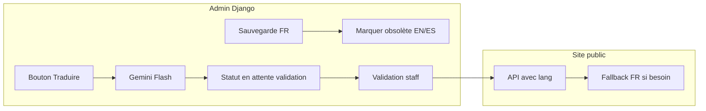

# Internationalisation (i18n) — FR / EN / ES

Documentation de référence pour la traduction du site : **frontend** (next-intl), **backend** (django-modeltranslation), **traduction automatique** (Gemini Flash via Google AI Studio), **user stories** validées et **gestion des erreurs / mises à jour**.

**Tableaux de données (MCP / inventaire)** : dossier [`../mcp-traduction/README.md`](../mcp-traduction/README.md) — champs BDD, pages, vue visiteur FR/EN/ES.

**Branche de travail prévue :** `traduction`  
**Statut :** spécification et doc — implémentation à faire.

---

## 1. Stack cible

| Couche | Choix | Rôle |
|--------|--------|------|
| Frontend | **next-intl** | Textes UI, URLs `/fr/...`, `/en/...`, `/es/...`, SEO |
| Backend | **django-modeltranslation** | Champs `*_fr`, `*_en`, `*_es` sur les modèles existants |
| Traduction auto | **Gemini Flash** (API Google AI Studio) | Génération / mise à jour des traductions BDD (hors workflow de validation) |

---

## 2. User stories validées (décisions produit)

### 2.1 Quand la traduction automatique se déclenche

- **Commande manuelle** : ex. `python manage.py translate_models --target=en` (et `--target=es`).
- **Bouton dans l’admin** : action « Traduire » sur la fiche d’un objet (déclenche la même logique que la commande, ciblée sur l’instance).

**Non retenu pour l’instant :** traduction à chaque sauvegarde, tâche planifiée seule (peut s’ajouter plus tard).

### 2.2 Traduction déjà présente (écrasement)

- **Ne pas écraser** une traduction existante sans accord explicite.
- **Marquer** qu’une **mise à jour automatique est disponible** (ex. badge « nouvelle version proposée » ou champ technique `*_translation_pending` / comparaison hash du source FR).

L’admin peut ensuite choisir d’appliquer la nouvelle suggestion ou garder la version actuelle.

### 2.3 Erreurs Gemini (quota, réseau, timeout)

- **Fallback affichage** : en cas d’échec pour une langue cible, le **contenu français** est utilisé côté API / site (voir § 4.2).
- **Retry** : l’objet ou le champ est **marqué pour réessai** (flag en BDD ou file de tâches / log structuré + commande `translate_models --retry-only`).

### 2.4 Mise à jour du texte source (FR)

- Quand le champ source (FR) change, les traductions EN/ES existantes sont marquées comme **« obsolètes »** (pas de re-traduction silencieuse systématique).
- L’admin voit l’état et peut lancer **Traduire** ou **Traduire la sélection** pour régénérer.

### 2.5 Interface admin

- **Barre de progression** par objet : ex. « 2 / 3 langues » (FR toujours rempli + statut EN/ES : vide / en attente / validé / obsolète).
- **Action groupée** dans les listes : **« Traduire la sélection »** (batch avec limite de débit API à respecter).

### 2.6 Workflow de publication des traductions

- Les textes générés par Gemini passent par un statut **« En attente de validation »** avant d’être **publiés** pour le site public.
- Implémentation typique : champs techniques (`translation_status_en`, etc.) ou modèle de brouillon / copie des champs ; les serializers publics ne renvoient que les versions **validées** ; fallback FR si pas encore validé (voir § 4.2).

### 2.7 Frontend — contenu BDD manquant

- Si la traduction validée n’existe pas pour la locale courante : **afficher le texte français** (pas de placeholder vide, pas de tag `[FR]` sauf évolution ultérieure).

---

## 3. Flux résumé

---

## 4. Comportements détaillés

### 4.1 Déclencheurs

| Événement | Comportement |
|-----------|----------------|
| Admin clique « Traduire » (fiche) | Appel Gemini pour les champs configurés, résultats en **pending** |
| Commande `translate_models` | Idem en masse (filtres : `--target`, `--retry-only`, `--model`, etc.) |
| Action « Traduire la sélection » | Même pipeline, liste d’IDs ; respecter quotas (pauses, batch size) |

### 4.2 Erreurs API Gemini

| Cas | Comportement |
|-----|----------------|
| Erreur réseau / 429 / timeout | Logger ; marquer **retry** ; ne pas vider les champs existants |
| Réponse invalide | Idem ; optionnellement enregistrer l’erreur sur l’objet |
| Affichage public | Serializer : locale demandée → champ validé ; sinon **FR** |

### 4.3 Mise à jour du français

| Cas | Comportement |
|-----|----------------|
| `name_fr` (ou équivalent) modifié | EN/ES validés → **obsolètes** ; suggestions auto non appliquées sans action admin |
| Admin valide une nouvelle traduction | Statut **publié** ; plus « obsolète » pour cette langue |

---

## 5. Frontend (next-intl) — rappel technique

- Structure cible : `app/[locale]/(main)/...` avec `middleware.ts` à la racine du projet Next.
- Fichiers de messages : `messages/fr.json`, `en.json`, `es.json`.
- **Navbar** : sélecteur de langue (desktop + mobile) ; liens via helpers next-intl pour préserver le préfixe `/fr`, `/en`, `/es`.
- **Appels API** : passer la locale (ex. `?lang=en` ou header `Accept-Language`) pour que le backend renvoie les bons champs.

Fichiers actuels à adapter (référence) :

- [frontend/src/app/(main)/layout.tsx](../../frontend/src/app/(main)/layout.tsx)
- [frontend/src/components/shared/Navbar.tsx](../../frontend/src/components/shared/Navbar.tsx)
- [frontend/src/lib/api.ts](../../frontend/src/lib/api.ts)

---

## 6. Backend (django-modeltranslation) — rappel technique

- `modeltranslation` **avant** `django.contrib.admin` dans `INSTALLED_APPS`.
- Un fichier `translation.py` par app enregistrant les modèles et les champs texte à traduire.
- `LANGUAGES = [('fr', ...), ('en', ...), ('es', ...)]`, `MODELTRANSLATION_DEFAULT_LANGUAGE = 'fr'`.
- Migrations après enregistrement : `makemigrations` + `migrate`.

**Traduction auto Gemini :**

- Variable d’environnement : `GEMINI_API_KEY` (clé [Google AI Studio](https://aistudio.google.com/)).
- Paquet Python : `google-generativeai` (ou SDK actuellement recommandé par Google pour Gemini).
- Commande de management : `translate_models` + logique partagée avec le bouton admin.

**Champs de workflow (à ajouter au modèle ou table technique) :**

- Statut par langue cible : `pending` | `approved` | `obsolete` (ou équivalent).
- Optionnel : hash du source FR pour détecter les changements sans comparer tout le texte.

---

## 7. Modèles concernés (champs texte)

Liste indicative des apps / modèles avec champs à internationaliser (détail des champs : voir code dans `backend/apps/*/models.py`) :

- **core** : DanceStyle, Level, DanceProfession, SiteConfiguration, MenuItem, Bulletin  
- **courses** : Course, TheoryLesson  
- **events** : Event, EventPass  
- **organization** : Pole, OrganizationNode, OrganizationRole, NodeEvent, TeamMember  
- **artists** : Artist  
- **partners** : Partner, PartnerNode, PartnerEvent, PartnerCourse  
- **care** : Practitioner, ServiceCategory, Service  
- **projects** : ProjectCategory, Project  
- **shop** : Category, Product  
- **trainings** : SubscriptionPass, TrainingSession  
- **users** : User (ex. `bio`)

Affiner progressivement : commencer par **SiteConfiguration**, **MenuItem**, **Course**, **Event**, **OrganizationNode** pour un premier incrément.

---

## 8. Plan d’implémentation (ordre recommandé)

1. **Frontend** : installer next-intl, middleware, déplacer les routes sous `[locale]`, messages JSON, LanguageSwitcher, migration progressive des textes UI.  
2. **Backend** : django-modeltranslation, premiers `translation.py`, migrations.  
3. **API** : middleware ou param `lang` + serializers qui exposent les champs validés avec fallback FR.  
4. **Gemini** : commande `translate_models`, intégration admin (bouton + action groupée), flags pending / obsolete / retry.  
5. **Validation** : écran ou actions « Approuver » pour passer de pending à publié.  
6. **Tests manuels** : FR/EN/ES + coupure API + contenu partiellement traduit.

---

## 9. Liens utiles

- [next-intl — App Router](https://next-intl.dev/docs/getting-started/app-router)  
- [django-modeltranslation](https://django-modeltranslation.readthedocs.io/)  
- [Gemini API — Google AI](https://ai.google.dev/gemini-api/docs)

---

## 10. Historique documentaire

| Date | Auteur | Changement |
|------|--------|------------|
| 2026-03-08 | Équipe / Cursor | Création : stack, user stories, erreurs, mises à jour, plan d’implémentation |

*Document vivant : à mettre à jour quand l’implémentation réelle diverge (noms de commandes, champs exacts, endpoints).*
