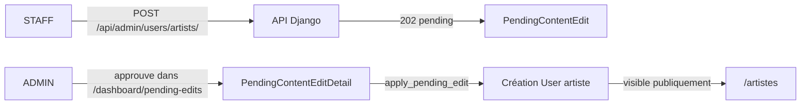

# Feature : Ajout d’artistes côté Front (Admin/Staff)

## Objectif
Permettre à l’`ADMIN` et au `STAFF` de créer des profils artistes depuis le front.  
Le `STAFF` crée une **demande en attente**, validée ensuite par un `ADMIN`.

---

## Où c’est dans le code
### Frontend
- Bouton “Ajouter un artiste” : `frontend/src/app/(main)/artistes/page.tsx`
- Page formulaire : `frontend/src/app/(main)/artistes/nouveau/page.tsx`
- Client API :
  - `frontend/src/lib/api.ts` → `createArtistAdmin()`, `getDanceProfessionsAdmin()`

### Backend (Django)
- API création artiste :
  - `POST /api/admin/users/artists/`
  - Vue : `backend/apps/users/views.py` → `ArtistAdminListCreateAPIView`
- API liste des professions :
  - `GET /api/admin/users/artists/professions/`
  - Vue : `backend/apps/users/views.py` → `DanceProfessionAdminListAPIView`
- Pending type et application :
  - Type pending ajouté : `backend/apps/core/models.py` → `PendingContentEdit.ContentType.USER_ARTIST_CREATE`
  - Application au moment de l’approbation : `backend/apps/core/pending_edits.py` dans `apply_pending_edit()`

---

## Flux d’approbation

---

## Notes
- La liste des artistes publiques n’affiche que les utilisateurs ayant au moins une profession (`User.professions`), donc pour qu’un artiste apparaisse, il doit avoir une ou plusieurs professions.

