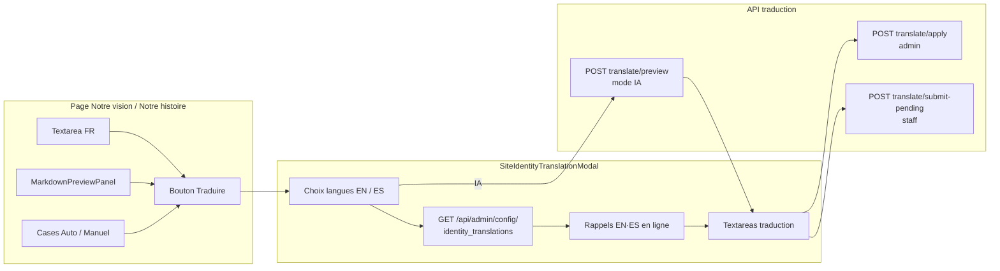

# Traduction admin — Identité COF (Notre vision / Notre histoire / Bulletins)

> Dernière mise à jour : 2025-03-07 — flux staff/admin pour traduire le Markdown Identité COF et les **bulletins** (titre + contenu EN/ES) avec aperçus, rappels des versions en ligne et schéma Mermaid ci-dessous.

## Objectif

Permettre au **staff** (proposition en attente) ou à l’**admin** (application directe) de traduire `vision_markdown` et `history_markdown` depuis les pages publiques, avec :

- choix **Auto (IA)** vs **Manuel** (exclusif) ;
- un seul bouton **Traduire** ouvrant une modale ;
- **aperçu du rendu FR** dans la page d’édition (`MarkdownPreviewPanel`) ;
- dans la modale, **rappel du texte EN/ES déjà enregistré** avant la session en cours (`TranslationBaselineReminder` + `GET /api/admin/config/`).

## Backend

| Élément | Détail |
|--------|--------|
| Champs | `vision_markdown`, `history_markdown` (modeltranslation : `_fr`, `_en`, `_es`) |
| `GET /api/admin/config/` | Staff authentifié : `{ "identity_translations": { "vision_markdown": { "en", "es" }, "history_markdown": { "en", "es" } } }` — valeurs **actuellement en base** pour la modale. |
| `POST /api/admin/translate/preview/` | Prévisualisation IA (Gemini) ; retourne entre autres `current_target` (texte cible déjà en base). |
| `POST /api/admin/translate/apply/` | Admin : enregistre la traduction sur la colonne `_en` / `_es`. |
| `POST /api/admin/translate/submit-pending/` | Staff : proposition multi-langue en attente validation. |

Implémentation : `backend/apps/core/views.py` (`SiteConfigurationAdminAPIView.get`, vues translate preview/apply/submit).

## Frontend

| Fichier | Rôle |
|---------|------|
| `NotreVisionClient.tsx` / `NotreHistoireClient.tsx` | Édition Markdown, `MarkdownPreviewPanel`, `TranslationModeCheckboxes`, `EditFormActionBar`, ouverture `SiteIdentityTranslationModal`. |
| `MarkdownPreviewPanel.tsx` | Aperçu rendu du FR (éditeur + onglet « version enregistrée » si besoin). |
| `TranslationModeCheckboxes.tsx` | Cases Auto (IA) / Manuel. |
| `EditFormActionBar.tsx` | Enregistrer, Annuler, **Traduire**. |
| `SiteIdentityTranslationModal.tsx` | Choix langues → édition EN/ES ; fetch baselines via `getSiteIdentityTranslationsAdmin()`. |
| `BulletinTranslationModal.tsx` | Idem pour un bulletin : **titre + contenu** par langue ; `object_id` = UUID du bulletin pour preview/apply/submit-pending. |
| `TranslationBaselineReminder.tsx` | Aperçu repliable du texte EN/ES **déjà en ligne** au-dessus de chaque textarea. |
| `frontend/src/lib/adminApi.ts` | `getSiteIdentityTranslationsAdmin()` + preview/apply/submit. |

## Schéma de flux

Vue d’ensemble page → modale → API (lisible dans GitHub / VS Code avec prise en charge Mermaid).

- **PREV** : uniquement si le mode choisi sur la page est **Auto (IA)** ; alimente les textareas avec la suggestion (éditable).
- **APP / SUB** : selon `isAdmin` à l’enregistrement dans la modale.

## Références croisées

- [Identité COF — vue d’ensemble](./identite-cof.md)
- [API BMAD](../bmad/03-api_docs.md) si présent
- [Traduction i18n générale](../explication/traduction-i18n.md)
