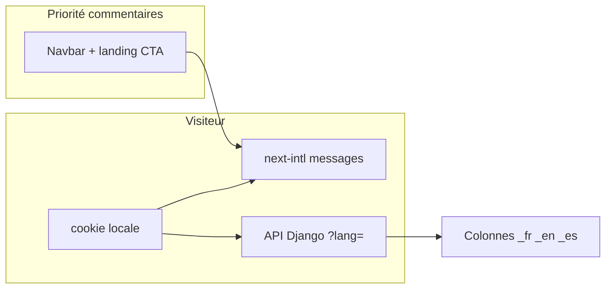

# Stratégie de traduction — décisions produit

Document de référence unique, aligné sur les commentaires du fichier source **[Etats des traductions 2.csv.csv](./Etats%20des%20traductions%202.csv.csv)** (export / état des traductions v2).

---

## Synthèse des choix

### À garder / déjà OK (dynamique BDD, modeltranslation)

- **Identité COF** : `vision_markdown`, `history_markdown`, bulletins (`title`, `content_markdown`), pôles, structure (nœuds), détail cours, événements / festivals / partenaires (même logique que les pages principales), explore, formations, inventaire BDD pour la plupart des champs marqués « Okay good ».

### Priorité UX immédiate — statique / encore en dur

- **Navbar** (`navbar.*` dans `frontend/messages/*.json`) : compléter **EN/ES** pour que le changement de langue affecte les libellés (menu injecté + entrées communes).
- **Menu déroulant** (titres injectés dans `Navbar.tsx` en fallback / complément API) : libellés dans **messages** + **next-intl**.
- **Landing** (`LandingPageClient.tsx`) : titres, accroches et **CTA** en traductions statiques par langue (`landing.*`).

### Hors périmètre court terme

- **Vidéos / config explore** : pas de traduction pour l’instant.
- **Hero unifié `SiteConfiguration`** (option) : pas besoin pour l’instant.
- **`site_name` / `hero_title`** : le site reste identique — pas d’obligation de variantes par langue (EN/ES vides ou copie FR selon politique).

### Cas « pas de traduction » (noms propres / lieux / personnes)

- **Lieux** : `Schedule.location_name`, `NodeEvent.location`, `Event.location_name` — **ne pas traduire** les noms de lieux (forme unique, souvent officielle).
- **Noms de personnes** (`TeamMember.name`) : pas de traduction.

### Cours / planning / événements

- **Liste cours + filtres** : besoin pour les visiteurs non francophones → **remplir EN/ES** sur `Course`, `DanceStyle`, `Level`, `DanceProfession` (champs prévus en BDD).
- **Planning** : si cours / événements sont déjà traduits, peu de travail supplémentaire sur la page (sauf libellés UI en dur → messages).

### Pages / apps pas encore dans `translation.py` (chantiers futurs)

- **Shop** : EN/ES par produit — modèles + `translation.py` + migrations dans `apps/shop`.
- **Care** : idem praticiens / soins.
- **Théorie** : champs déjà traduits côté `TheoryLesson` ; travail = **contenu** + `translate_models` / édition admin.

### Admin / métier

- **Édition bulletin** : réservée aux **admins français** — pas d’obligation i18n sur le formulaire.
- **Pending edits** : file **française** — OK.
- **Login / register** : **libellés de formulaires** en EN/ES via `messages` uniquement, pas le profil utilisateur.

### Glossaire « c’est quoi ? »

- **`MenuItem.name`** : entrées du menu éditées dans l’**admin Django** ; l’API `GET /api/menu/items/` renvoie ces libellés (avec `?lang=`). Voir aussi [README](./README.md).
- **`EventPass.name`** : nom d’un **type de billet** (pass) lié à un événement — traduisible en BDD si besoin de libellés différents par langue.

---

## Décision tranchée : `/organisation/noeuds/[slug]`

**Contexte** : l’inventaire prévoit des champs traduits sur `OrganizationNode`, alors qu’un commentaire indiquait « pas besoin de traduction » pour cette page.

**Décision produit** :

- **Aucune désactivation technique** des colonnes `_fr` / `_en` / `_es` sur `OrganizationNode` : elles restent disponibles (cohérence avec le reste du référentiel organisation).
- **Priorité éditoriale** : la page détail **nœud** (`/organisation/noeuds/[slug]`) n’est **pas prioritaire** pour remplir ou relire EN/ES dans l’immédiat ; l’effort se concentre d’abord sur identité, cours, événements et UI statique (navbar / landing).
- Les **noms propres** de lieux / personnes suivent les règles ci-dessus (pas de « traduction » au sens libellé localisé).

---

## Lot 2 — Priorisation remplissage EN/ES (BDD)

Ordre recommandé (ajustable selon charge métier) :

1. **`Course`** + champs listés / fiche cours (titres, descriptions utiles aux listes).
2. **Référentiels** : `DanceStyle`, `Level`, `DanceProfession` (filtres + affichage).
3. **Événements** : `Event`, passes (`EventPass`) si les libellés de billets doivent varier par langue.
4. **Bulletins / identité** si le trafic international le justifie en parallèle.

**Moyens** : édition dans l’admin Django (champs traduits) ou commande de bootstrap **`translate_models`** (`backend/apps/core/management/commands/translate_models.py`) pour pré-remplir à partir du FR, puis relecture humaine.

---

## Schéma de flux (rappel)

---

## Prochaines étapes (hors ce document)

- Lot 1 : messages `en` / `es` + clés `navbar` / `landing` ; plus de chaînes françaises en dur sur ces zones.
- Lot 2 : exécuter le remplissage BDD selon la priorité ci-dessus.
- Lot 3 : shop / care si besoin métier ; documentation admin pour `MenuItem` / passes événement.

*Dernière mise à jour : alignement sur le plan « Stratégie traduction commentaires ».*
