# Modèle Conceptuel de Données (MCD) – BachataVibe V5

Référentiel des entités et relations, aligné sur le backend Django actuel (V4) et cible V5.

---

## Phasage — Domaines par phase

| Domaine | Phase | Implémentation |
|---------|-------|----------------|
| **Core** (BaseModel, DanceStyle, Level, DanceProfession, SiteConfiguration, MenuItem) | 1 | MVP — référentiels + navbar |
| **Users** | 1 | MVP — auth, rôles |
| **Organization** (OrganizationNode, OrganizationRole, UserOrganizationRole, NodeEvent) | 1 | MVP — Explore 3D, overlay |
| **Courses** | 1 | MVP — catalogue, filtres |
| **Events** | 1 | MVP — calendrier, passes |
| **Shop / Boutique** | 2 | Phase 2 — catalogue produits, commandes |
| **Formations** | 2 | Phase 2 — contenu en ligne, vidéothèque |
| **Trainings** | 2 | Phase 2 — sessions, adhérents |
| **Artistes** | 2 | Phase 2 — annuaire, booking, avis |
| **Théorie** | 2 | Phase 2 — cours théoriques, quiz |
| **Care** | 2 | Phase 2 — soins, praticiens, réservation |
| **Projets** | 2 | Phase 2 — incubation, initiatives |

---

## 1. Entités et attributs

### 1.1 Core (référentiels et configuration)

| Entité | Attributs | Remarque |
|--------|-----------|----------|
| **BaseModel** (abstrait) | id (UUID), created_at, updated_at | Hérité par la plupart des entités |
| **DanceStyle** | name, slug, parent_id (FK self), icon, description | **Récursif** : un style peut être sous-style d'un autre (ex. Bachata Sensual ⊂ Bachata) |
| **Level** | name, slug, order, color, description | Niveaux de danse |
| **DanceProfession** | name, slug, description | **Métiers** : référentiel (ex. professeur, DJ, caméraman). Un utilisateur peut en avoir plusieurs (M-N avec User). |
| **SiteConfiguration** | site_name, hero_title, hero_subtitle, hero_video_url, updated_at | Singleton (pk=1) |
| **MenuItem** | name, slug, parent_id (FK self), url, icon, order, is_active | Menu navbar : **récursif** (parent / children). Ordre d'affichage par `order`. `url` pointe vers une route du site (ex. `/boutique/`, `/explore/`). Référence : [04-maquettes_ui_jour](04-maquettes_ui_jour.md) section 5. |

### 1.2 Users

| Entité | Attributs | Remarque |
|--------|-----------|----------|
| **User** | Hérite AbstractUser + BaseModel ; phone, bio, profile_picture, dance_level_id (FK Level) ; **is_vibe** (bool) ; **métiers** : M-N DanceProfession | **is_vibe** : indique si l'utilisateur est "Vibe" (membre / part du collectif). **Métiers** : plusieurs possibles via relation M-N avec **DanceProfession** (ex. caméraman, DJ, professeur). |

### 1.3 Organization (Capital of Fusion)

| Entité | Attributs | Remarque |
|--------|-----------|----------|
| **OrganizationNode** | name, slug, parent_id (FK self), type (ROOT/BRANCH/EVENT), video_url, description, cover_image, short_description, content, cta_text, cta_url ; visual_source, planet_type, model_3d, planet_texture, planet_color, orbit_radius, orbit_speed, planet_scale, rotation_speed, orbit_phase, orbit_shape, orbit_roundness ; entry_start_x/y/z, entry_speed ; is_visible_3d | **Récursif** : un noeud peut avoir un parent (ex. BachataVibe Paris ⊂ Capital of Fusion) ; arborescence + paramètres 3D et overlay |
| **OrganizationRole** | name, slug, description | Rôles (participant, artiste, admin…) |
| **UserOrganizationRole** | user_id, node_id, role_id | Table d'association User – Node – Role (M-N avec attributs) |
| **NodeEvent** | node_id, title, description, start_datetime, end_datetime, location, image, is_featured, external_url | Événements affichés dans l'overlay d'un noeud |

### 1.4 Courses

| Entité | Attributs | Remarque |
|--------|-----------|----------|
| **Course** | name, slug, description, style_id (FK DanceStyle), level_id (FK Level), node_id (FK OrganizationNode), is_active, image ; teachers M-N User | |
| **Schedule** | course_id, day_of_week, start_time, end_time, location_name | Horaires récurrents par cours |
| **Enrollment** | user_id, course_id, enrolled_at, is_active | Inscription utilisateur à un cours (unicité user + course) |

### 1.5 Events (festivals / soirées)

| Entité | Attributs | Remarque |
|--------|-----------|----------|
| **Event** | name, slug, type (FESTIVAL/PARTY/WORKSHOP), description, start_date, end_date, location_name, node_id (FK OrganizationNode), image | |
| **EventPass** | event_id, name, price, quantity_available | Pass (Full Pass, Social Pass…) |
| **Registration** | user_id, event_pass_id, registered_at, is_paid | Inscription à un pass |

### 1.6 Shop / Boutique

| Entité | Attributs | Remarque |
|--------|-----------|----------|
| **ProductCategory** | name, slug, order, description | Référentiel : Pulls & Sweats, T-shirts, Chaussures, Vins & Spiritueux (sous-menus Boutique/Shop) |
| **Product** | name, slug, description, price, stock, image, **node_id (FK OrganizationNode)**, **category_id (FK ProductCategory)** | Catalogue par noeud ; une catégorie par produit pour filtres / URLs `/boutique/pulls/` etc. |
| **Order** | user_id, status (PENDING/PAID/SHIPPED/CANCELLED), total_amount | Voir évolutions : payment_reference, currency |
| **OrderItem** | order_id, product_id, quantity, price_at_order | Ligne de commande |

### 1.7 Formations

| Entité | Attributs | Remarque |
|--------|-----------|----------|
| **FormationCategory** | name, slug, order, description | Catégories de contenu (menu Formations > Catégories) |
| **FormationContent** | name, slug, description, content (HTML/texte), category_id (FK FormationCategory), type (ARTICLE/VIDEO), video_url, order, is_published | Contenu éducatif en ligne ; type VIDEO pour la vidéothèque |
| **FormationVideo** | formation_content_id (FK FormationContent), video_url, duration, thumbnail | Optionnel : si vidéothèque séparée, sinon type sur FormationContent |

### 1.8 Trainings

| Entité | Attributs | Remarque |
|--------|-----------|----------|
| **TrainingSession** | name, slug, description, start_datetime, end_datetime, location_name, max_participants, node_id (FK OrganizationNode) optionnel | Sessions libres (menu Trainings > Sessions libres) |
| **TrainingSessionRegistration** | user_id, session_id, registered_at, status | Inscription à une session |
| **TrainingAdherent** | user_id, node_id (FK OrganizationNode), role, notes | Organisation adhérents (menu Trainings > Organisation adhérents) ; lien User – Node pour les adhérents d'un pôle |

### 1.9 Artistes

| Entité | Attributs | Remarque |
|--------|-----------|----------|
| **Artist** | user_id (FK User, optionnel), name, slug, bio, photo, styles (M-N DanceStyle), website, social_links (JSON ou table dédiée), is_visible | Annuaire & Profils : un artiste peut être lié à un User ou créé seul |
| **ArtistBooking** | artist_id, requester_id (FK User), event_name, requested_date, location, message, status (PENDING/CONFIRMED/REFUSED), created_at | Demandes de booking (menu Artistes > Booking) |
| **ArtistReview** | artist_id, user_id, rating (1–5), comment, created_at | Avis & Notes (menu Artistes > Avis & Notes) ; unicité (user, artist) possible |

### 1.10 Théorie

| Entité | Attributs | Remarque |
|--------|-----------|----------|
| **TheoreticalCourse** | name, slug, description, content, order, level_id (FK Level) optionnel | Cours théoriques (menu Théorie > Cours théoriques) |
| **Quiz** | name, slug, theoretical_course_id (FK TheoreticalCourse) optionnel, passing_score, order | Quiz de connaissances (menu Théorie > Quiz) |
| **QuizQuestion** | quiz_id, question_text, order, correct_answer_id (ou champ réponse) | Questions d'un quiz |
| **TheoryProgression** | user_id, theoretical_course_id, quiz_id optionnel, completed_at, score optionnel | Suivi de progression (menu Théorie > Suivi) ; une ligne par cours complété ou par quiz passé |

### 1.11 Care

| Entité | Attributs | Remarque |
|--------|-----------|----------|
| **CareService** | name, slug, description, duration_minutes, price, is_active | Soins & Récupération (menu Care > Soins) |
| **Practitioner** | user_id (FK User) ou name, slug, bio, photo, speciality, care_services (M-N CareService) | Nos Praticiens (menu Care > Praticiens) |
| **CareBooking** | user_id, practitioner_id, care_service_id, requested_datetime, status (PENDING/CONFIRMED/CANCELLED), notes | Réservation (menu Care > Réservation) |

### 1.12 Projets

| Entité | Attributs | Remarque |
|--------|-----------|----------|
| **Project** | name, slug, description, content, type (INCUBATION/INITIATIVE), image, start_date, end_date, node_id (FK OrganizationNode) optionnel, order | Programme d'incubation & Autres initiatives (menu Projets) ; distinguer par `type` ou par catégorie |

---

## 2. Relations et cardinalités

```
User 1——N Enrollment N——1 Course
User 1——N Registration N——1 EventPass 1——N Event
User 1——N Order N——1 User
Order 1——N OrderItem N——1 Product

User M——N DanceStyle (dance_styles)
User M——N DanceProfession (dance_professions)
User N——1 Level (dance_level)
User M——N OrganizationNode via UserOrganizationRole N——1 OrganizationRole

Course N——1 DanceStyle
Course N——1 Level
Course N——1 OrganizationNode
Course M——N User (teachers)
Course 1——N Schedule

DanceStyle 1——N DanceStyle (parent / sub_styles)
MenuItem 1——N MenuItem (parent / children)
OrganizationNode 1——N OrganizationNode (parent / children)
OrganizationNode 1——N NodeEvent
OrganizationNode 1——N Event
OrganizationNode 1——N Product
Product N——1 ProductCategory

FormationContent N——1 FormationCategory
TrainingSession 1——N TrainingSessionRegistration N——1 User
TrainingAdherent : user_id, node_id (User – OrganizationNode)
Artist 1——N ArtistBooking N——1 User
Artist 1——N ArtistReview N——1 User
Artist N——1 User (optionnel)
Artist M——N DanceStyle

Quiz 1——N QuizQuestion
TheoreticalCourse 1——N TheoryProgression N——1 User
Quiz 1——N TheoryProgression N——1 User
TheoreticalCourse 1——N Quiz (optionnel)

CareService M——N Practitioner (via table si besoin)
CareBooking N——1 User ; N——1 Practitioner ; N——1 CareService
Practitioner N——1 User (optionnel)

Project N——1 OrganizationNode (optionnel)
```

---

## 3. Schéma relationnel (résumé)

```mermaid
erDiagram
    User ||--o{ Enrollment : "a des"
    Course ||--o{ Enrollment : "a des"
    User ||--o{ Registration : "a des"
    EventPass ||--o{ Registration : "a des"
    Event ||--o{ EventPass : "a des"
    User ||--o{ Order : "a des"
    Order ||--o{ OrderItem : "contient"
    Product ||--o{ OrderItem : "dans"
    User }o--o{ DanceStyle : "dance_styles"
    User }o--o{ DanceProfession : "dance_professions"
    User }o--|| Level : "dance_level"
    User ||--o{ UserOrganizationRole : "a"
    OrganizationNode ||--o{ UserOrganizationRole : "a"
    OrganizationRole ||--o{ UserOrganizationRole : "a"
    Course }o--|| DanceStyle : "style"
    Course }o--|| Level : "level"
    Course }o--|| OrganizationNode : "node"
    Course ||--o{ Schedule : "a des"
    DanceStyle ||--o{ DanceStyle : "parent"
    MenuItem ||--o{ MenuItem : "parent"
    OrganizationNode ||--o{ OrganizationNode : "parent"
    OrganizationNode ||--o{ NodeEvent : "a des"
    OrganizationNode ||--o{ Event : "a des"
    OrganizationNode ||--o{ Course : "a des"
    OrganizationNode ||--o{ Product : "a des"
    Product }o--|| OrganizationNode : "node"
    Product }o--|| ProductCategory : "category"
    ProductCategory ||--o{ Product : "a des"
    Event }o--|| OrganizationNode : "node"
    Course }o--o{ User : "teachers"
    FormationContent }o--|| FormationCategory : "category"
    TrainingSession ||--o{ TrainingSessionRegistration : "a des"
    User ||--o{ TrainingSessionRegistration : "a des"
    User ||--o{ TrainingAdherent : "a des"
    OrganizationNode ||--o{ TrainingAdherent : "a des"
    Artist ||--o{ ArtistBooking : "a des"
    User ||--o{ ArtistBooking : "demande"
    Artist ||--o{ ArtistReview : "a des"
    User ||--o{ ArtistReview : "a des"
    Artist }o--o{ DanceStyle : "styles"
    Artist }o--|| User : "user"
    Quiz ||--o{ QuizQuestion : "a des"
    TheoreticalCourse ||--o{ TheoryProgression : "a des"
    User ||--o{ TheoryProgression : "a des"
    Quiz ||--o{ TheoryProgression : "a des"
    CareBooking }o--|| User : "user"
    CareBooking }o--|| Practitioner : "praticien"
    CareBooking }o--|| CareService : "service"
    Practitioner }o--o{ CareService : "services"
    Practitioner }o--|| User : "user"
    Project }o--|| OrganizationNode : "node"
```



---

## 4. Dépendances entre domaines

- **Core** : indépendant (référentiels + SiteConfiguration + MenuItem).
- **User** : dépend de Core (Level, DanceStyle, DanceProfession) et Organization (UserOrganizationRole).
- **Organization** : dépend de Core (BaseModel) ; référencé par Courses, Events, User (rôles), Product, TrainingSession, Project.
- **Courses** : dépend de Core, Users, Organization.
- **Events** : dépend de Core, Users, Organization.
- **Shop** : dépend de Core, Users, **Organization**, **ProductCategory** (Product + catégories Boutique/Shop).
- **Formations** : dépend de Core (BaseModel) ; FormationCategory, FormationContent (optionnel FormationVideo).
- **Trainings** : dépend de Core, Users, Organization (TrainingAdherent, TrainingSession optionnel node_id).
- **Artistes** : dépend de Core (DanceStyle), Users (Artist lié User, Booking/Review).
- **Théorie** : dépend de Core (Level optionnel), Users (TheoryProgression).
- **Care** : dépend de Core, Users (Practitioner, CareBooking).
- **Projets** : dépend de Core, Organization (Project optionnel node_id).

---

## 5. Règles métier et choix de modélisation

### Utilisateur : is_vibe et métiers

- **is_vibe** (booléen sur User) : indique si l'utilisateur fait partie du "Vibe" (collectif / membre actif). Utilisable pour filtres, badges, accès ou affichage spécifique.
- **Métiers** : un utilisateur peut avoir **plusieurs métiers** (caméraman, DJ, professeur, etc.) via la relation M-N **User ↔ DanceProfession**. Le référentiel **DanceProfession** contient les métiers (name, slug, description). En base, créer au moins : professeur, DJ, caméraman ; d'autres peuvent être ajoutés (chorégraphe, organisateur, etc.) sans changer le modèle.

### Structures récursives

- **DanceStyle** : relation réflexive via `parent_id` (FK vers DanceStyle). Un style de danse peut être le **sous-style** d'un autre (ex. Bachata Sensual, Bachata Dominicana comme sous-styles de Bachata). La profondeur est libre (arbre).
- **OrganizationNode** : relation réflexive via `parent_id` (FK vers OrganizationNode). Un noeud peut avoir un **parent** (ex. branche "BachataVibe Paris" sous "Capital of Fusion"). Structure hiérarchique pour l'organisation et la scène 3D (planètes / orbites).
- **MenuItem** : relation réflexive via `parent_id` (FK vers MenuItem). Un élément peut avoir des **children** (sous-menus en dropdown). L'ordre d'affichage dans la navbar est donné par le champ `order` (tri par ordre puis nom). Racines : `parent_id` NULL.

### Menu de navigation (structure cohérente avec la navbar)

La navbar est pilotée par **MenuItem** (API `GET /api/menu/items/`). Pour rester cohérent avec les maquettes :

- **Ordre des entrées de premier niveau** (champ `order` à renseigner en base) :  
  1. Accueil (url `/`, pas d'enfants), 2. Boutique, 3. Événements, 4. Explore, 5. Cours, 6. Formations, 7. Trainings, 8. Artistes, 9. Théorie, 10. Care, 11. Shop, 12. Projets, 13. Organisation.
- **Sous-menus** : chaque entrée (sauf Accueil) peut avoir 0..N **children** (MenuItem avec `parent_id` = cet item). Exemples : Boutique → Pulls & Sweats, T-shirts, Chaussures, Vins & Spiritueux ; Cours → Liste & Planning, Filtres, Détails des programmes, Inscription ; Organisation → Structure, Pôles.
- **URLs** : `url` doit correspondre aux routes du site (ex. `/boutique/`, `/evenements/`, `/explore/`, `/cours/`, `/organisation/structure/`). Les sous-pages (ex. `/boutique/pulls/`) sont des MenuItem enfants avec leur propre `url`.
- **Référence détaillée** : liste complète des parents et sous-menus dans [04-maquettes_ui_jour.md](04-maquettes_ui_jour.md) section 5 (ordre et tableau des dropdowns). Le script `populate_menu.py` doit produire des MenuItem dont l'ordre et la hiérarchie respectent cette structure.

### Correspondance Menu → Modèles (données par section)

| Section menu | Sous-pages (exemples) | Entités / modèles du MCD |
|--------------|------------------------|---------------------------|
| **Boutique** | Pulls & Sweats, T-shirts, Chaussures, Vins & Spiritueux | ProductCategory, Product |
| **Événements** | Liste & Événements, Festivals | Event, EventPass, Registration ; filtrer par type pour Festivals |
| **Explore** | Expérience 3D, Arbre / Liste | OrganizationNode (même données, vues différentes) |
| **Cours** | Liste & Planning, Filtres, Détails programmes, Inscription | Course, Schedule, Enrollment |
| **Formations** | Contenu en ligne, Catégories, Vidéothèque | FormationCategory, FormationContent (type ARTICLE/VIDEO) |
| **Trainings** | Sessions libres, Organisation adhérents | TrainingSession, TrainingSessionRegistration ; TrainingAdherent |
| **Artistes** | Annuaire, Profils & Bios, Booking, Avis & Notes | Artist, ArtistBooking, ArtistReview |
| **Théorie** | Cours théoriques, Quiz, Suivi de progression | TheoreticalCourse, Quiz, QuizQuestion, TheoryProgression |
| **Care** | Soins & Récupération, Praticiens, Réservation | CareService, Practitioner, CareBooking |
| **Shop** | (identique à Boutique) | ProductCategory, Product |
| **Projets** | Programme d'incubation, Autres initiatives | Project (type INCUBATION / INITIATIVE) |
| **Organisation** | Structure, Pôles | OrganizationNode (arborescence, vues Structure / Pôles) |

### NodeEvent vs Event (deux concepts distincts)

- **NodeEvent** : annonces / agenda affiché dans l'overlay d'un noeud (planète). Pas de billetterie ni de pass ; champs légers (titre, dates, lieu, lien externe). Usage : planning cours, petites annonces de la branche.
- **Event** : gros événements (festivals, soirées, stages) avec billetterie : EventPass (tarifs, quotas) et Registration (inscriptions, is_paid). Toujours lié à un OrganizationNode.
- À garder séparés : pas de fusion ni de lien obligatoire entre les deux.

### Produits par noeud

- Le catalogue **Product** est rattaché à un **OrganizationNode** (une branche = un catalogue). Une commande peut concerner des produits de plusieurs noeuds ; le lien Product → Node permet de filtrer par branche et d'afficher "Boutique BachataVibe Paris" etc.
- **Slug** : à définir — unicité globale (slug unique sur tout le site) ou par noeud (unicité (node_id, slug)).

---

## 6. Évolutions recommandées pour la V5

Pistes à trancher ou implémenter au fil de la V5 :

| Domaine | Évolution | Raison |
|---------|-----------|--------|
| **Product** | Ajouter `node_id` (FK OrganizationNode) | Catalogue par branche (décision retenue). |
| **Product** | `is_active` ou `is_visible` | Masquer un produit sans le supprimer. |
| **Order** | `payment_reference` (ou `payment_id`) | Traçabilité paiement (Stripe, etc.). |
| **Order** | `currency` | Si multi-devises ou pour l'affichage. |
| **EventPass** | `quantity_available = NULL` pour "illimité" | Éviter la valeur magique -1. |
| **EventPass** | `currency` | Cohérence avec Order. |
| **Course** | `max_capacity` (optionnel) | Limiter les inscriptions. |
| **Course** | Lien vers Product (optionnel) | Si certains cours sont payants via la boutique. |
| **UserOrganizationRole** | `start_date` / `end_date` ou `is_active` | Période de validité du rôle. |
| **Slugs** | Documenter l'unicité (globale vs par parent/node) | MenuItem, Course, Product : éviter les conflits. |
| **Soft delete** | `deleted_at` ou `is_archived` sur entités métier | Conserver l'historique (Course, Event, Product, Node). |
| **i18n** | Pas dans le MCD actuel ; à prévoir plus tard si FR/EN | Tables de traduction ou champs JSON. |

Ce MCD sert de base pour la V5 ; les évolutions ci-dessus peuvent être prises en compte par étape dans le backend.

---

*Copié depuis refactorisation_V5_Structuré (V4) — 2025-02-10 — avec table de phasage ajoutée.*
